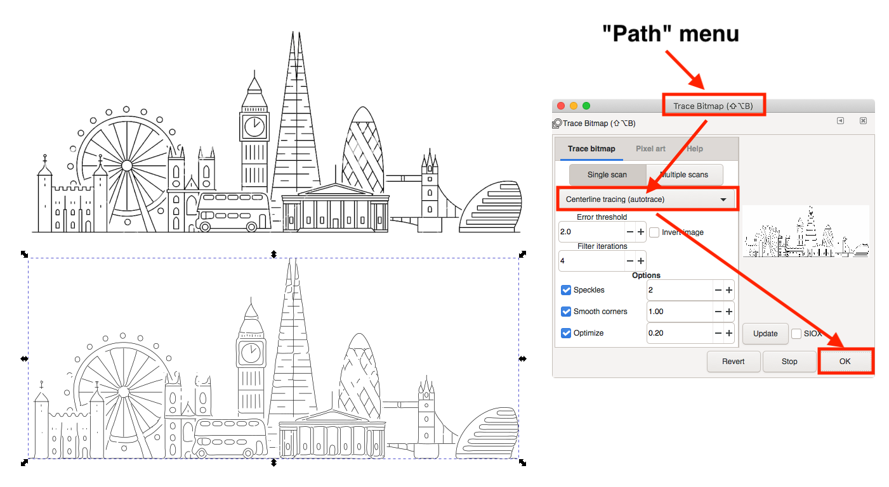
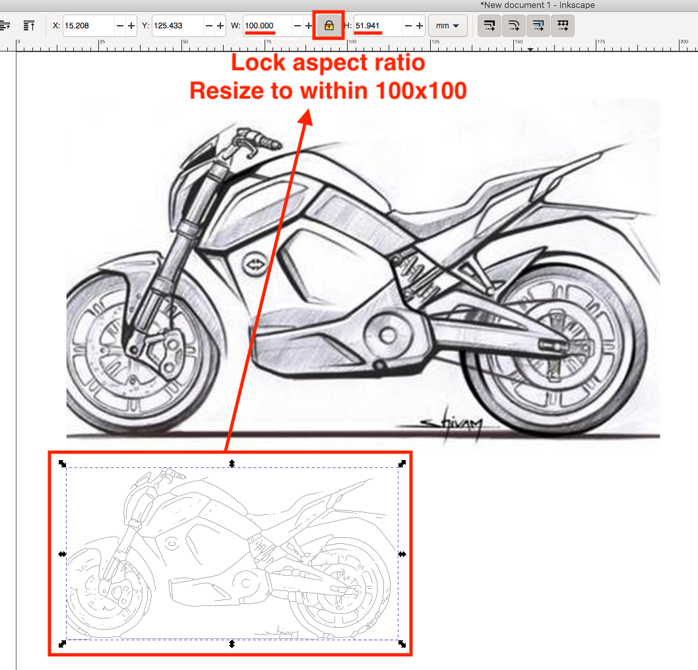

[中文介绍点此处](README_CN.md)

# LaserPecker Extension for Inkscape
This is a Gcode generator extension for Inkscape, tailored for LaserPecker L1 and L1 Pro. The LaserPecker App has a built-in Gcode converter with capability of line-filling, which is pretty easy to use. This extension allows you to manually set power and speed beyond the App's limitations with Gcode values. (Hardware limitations still apply. Read on...)

## LaserPecker
LaserPecker is a brand of affordable and portable consumer level laser engravers.
For more details, visit their official [English site](https://www.laserpecker.net/) or [Chinese site](http://www.laserpecker.cn/).

## Compatibility

This extension has been tested with LaserPecker L1 and L1 Pro. There are 2nd and 3rd generations to be released soon, and I will keep updating this extension to support those.

## Installation

1) Install Inkscape v0.92 or v1.0 (use v1.0 if you can)
2) Depending on your Inkscape version and operating system, copy `laserpecker.inx` and `laserpecker.py` from `extension/0.92` or `extension/1.0` directory into...
	* For Linux: `~/.config/inkscape/extensions/`
	* For Mac: Launch Inkscape > `Preferences` > `System` > Look for `User extensions` > click `Open`
	* For Windows: `C:\Program Files\Inkscape\share\extensions\`
3) Restart Inkscape and you should be able to access the extension from `Extensions` > `LaserPecker` > `Gcode Generator for L1/Pro`

## Settings and Limitations

* Laser head idle movement speed is hard-coded to 3000mm/min, as this is what's used in LaserPecker's official sample Gcode files.
* Lowest laser speed is limited to 70mm/min, as this is the lowest effective speed that LaserPecker App allows. i.e. I tested speeds from 0.01 to 70mm/min and they all came out the same on the engraver end.
* Laser power can be set from 1 (min) to 255 (max). (0=off, which makes the Gcode useless, so I disallowed it.)
* Engraving area is limited to 100mm x 100mm in size.
* This extension warns if the target graphics are larger than 100mm x 100mm, and you should scale it down and try again.
* The origin (0,0) is in the centre of the 100mm x 100mm engraving area. i.e. the absolute coordinates range from (-50,-50) to (50,50). Although LaserPecker L1 (not Pro) is capable of engraving a much larger area, from (-100,-70) to (100,70) as I manually tested, it is limited to 100mm x 100mm by the App and the machine to minimise distortion and ensure consistent engraving quality. See [engraving_over_200mm_x_140mm.mp4](misc/engraving_over_200mm_x_140mm.mp4) and [engraving_over_200mm_x_140mm.jpg](misc/engraving_over_200mm_x_140mm.jpg) for a demo.
* The position of target graphics on Inkscape canvas is irrelevant. This extension will automatically offset X,Y coordinates, so that the resulting Gcode coordinates are centred to the origin (0,0).
* Output Gcode file should end in `.txt`. The extension does not normally matter, as it's just a plain text file, but here `.txt` is what's recognised as Gcode files by LaserPecker App.
* Output Gcode file should not exceed 1MB in size. This is a hard limit by the engraver's memory.

## Image to Gcode

1) Launch Inkscape.
2) Import an image, preferably a black and white image onto the blank canvas.
3) Select the image, then "Path" > "Trace Bitmap"
4) Use the following optimal settings:
	* Colours: 2
	* Scans: 2
	* Smooth: check
	* Stack scans: check
	* Remove background: check
	* Live Preview: check
	* the rest is up to you to poke around and figure out what's best for your image.
5) Click "OK" button **once** and close this pop up.
6) The vectorised image is stacked on top of your bitmap image. (Optional: Move it away, and then select and delete your bitmap image underneath to avoid confusion.)
7) It does not matter where you position the vectorised graphics, as long as its size is within 100mm x 100mm. Use the W and H values displayed in the tool bar to help scale your graphics.
8) Select all of your shapes if you have more than one. They do not have to be grouped. Now, just in case, double convert them to path from "Path" > "Object to Path".
9) `Extensions` > `LaserPecker` > `LaserPecker Gcode Generator`
10) Fill in the values as prompted and click `Apply` to generator Gcode.
11) Ignore any warnings. The auto generated markers overlay on top of your grapgics can be deleted.

## Filling Your Shapes With Lines

You may have noticed that only the edges of your graphic are converted to paths, and therefore to Gcode. While this is desireable in some situations, like for cutting shapes out of your materials, we sometimes want to fill the shapes so they look like the original image, not just a hollow trace.

Here is how:

* you need to download and install KM-Laser extension ([for Inkscape 0.92](https://github.com/KnoxMakers/KM-Laser/tree/pre_0.92), [for Inkscape 1.0](https://github.com/KnoxMakers/KM-Laser))
* and learn how to fill your shape with lines by watching this video tutorial:

There are three options you can tweak:

* **Hatch spacing:** first to reduce your shape stroke thickness to very low, so you can see the paths clearly. Then enable live preview and try out different spacing for your desired effect.
* **Hatch angle:** commonly we use 0 or 45 degrees.
* **Crosshatch:** cross fill or one-way parallel fill. Note that cross fill is twice long as parallel fill.

It is that easy! After filling your shape, generate Gcode as you would and optionally inspect your Gcode (read the next section) before engraving.

## Convert B&W Images to Single Line Sketches

### Inkscape 0.92 users
1) follow this [guide (TL;DR part)](https://github.com/yy502/autotrace#tldr) to compile & install `autotrace` (linux-only I'm afraid).
2) Use the single-line command shown in the link above to convert your bitmap (png) image to svg
3) Use this Gcode extension to generate Gcode for LaserPecker.
	* Note that svg file generated by `autotrace` is using px as default unit, and there's **no need** to change it to mm before resizing your graphic. As long as the width x height numerical values are within 100x100, the Gcode entension will work and treat them as mm.
4) Note that you may see some warning messages during generation. As long as there's no error, you can ignore them. In the end, if you see some horrible overlay of arrows appear on top of your graphic, the Gcode is generated OK, and you can move or delete this layer as you wish.

### Inkscape 1.0 users
1) Inkscape 1.0 has this amazing tool built-in! \o/
2) Launch Inkscape, drag and drop a B&W image into Inkscape canvas. Don't need to worry about resizing it for now.
3) Click to select the image, go to `Path` menu, then `Trace Bitmap`. From the drop-down list, select `Centerline tracing (autotrace)`. Leave other settings as default should be fine. Finally click `OK`.
4) The generated centerline trace is overlpping the original image, so it's not easily visible. Click on the image and drag it down to see the line trace on its own.
5) With this line trace selected, go to the top tool bar, lock aspect ratio and resize selection to witin 100x100 mm.
6) Finally use this Gcode extension to generate Gcode for LaserPecker.
7) Note that you may see some warning messages during generation. As long as there's no error, you can ignore them. In the end, if you see some horrible overlay of arrows appear on top of your graphic, the Gcode is generated OK, and you can move or delete this layer as you wish.

## Optional: Inspect Generated Gcode

1) Open up the generated file with a text editor
2) Select all texts and copy
3) Open [NC Viewer](https://ncviewer.com/)
4) Clear the sample Gcode and paste your Gcode in
5) Click the blue "Plot" button to visualise your Gcode.

## Sending Gcode Files to App

Once the `.txt` Gcode files are generated...

* **Android:** copy to `(phone storage) > laserpecker files` directory in your phone. This is also where additional custom fonts (`.ttf` files) live.
* **iOS:** copy to `(Files App)> Laserpecker > matarialgcode` directory (yes, the directory name is misspelt).

## Sample Images

I have included a few sample images for you to test convert to Gcode and engrave with LaserPecker. The reason why I did not include any sample Gcode is because you will need to choose the best settings (power,speed) for your material at the point of generation.

## Helper Files

In `testing` directory, I have created some Gcode files to help you quickly test and find out the optimal power+speed settings for cutting or engraving your target material.

* `engraving_test_p160-255,s500-800.txt`: Sweep across different power and speeds with small step sizes to help you map different engraving results to accurate Gcode settings (power,speed).
* `cutting_test_p200-255,s70-400.txt`: This helps you to find the lowest possible setting that your material can be cut with. If even the highest setting (p255,s70) is unable to cut your material, consider cutting multiple times.
* `sample_result.jpg`: Test results on a recycled paper.

In `misc` directory, there are several sets of `markers` files. Each set has the following files:
* `.svg`: The SVG file of the markers. Open it with Inkscape and convert to Gcode with your choice of settings and test your LaserPecker's engraving distortion and sizing.
* `.txt`: Gcode for the markers with speed=500 and power=200. This is MUCH faster than using a bitmap image to engrave the markers over the 100mm x 100mm area.
* `.png`: PNG image of the markers only for quick preview. I do not suggest engraving this as it's MUCH slower than using Gcode.

## Experimental Extension for L1

This extension helps you to utilise absolute Gcode coordinates and engrave over 200mm x 140mm area with L1 model.
However, the oversize engraving result has been inconsistent around the far ends. In my opinion it's not worth the hassle, so I have stopped working on this. There's a chance that LaserPecker will officially unlock this capability, if they manage to reduce distortion via their App.

## Credit
This extension is based on [J Tech Laser Tool Plugin V 2_2 for Inkscape](https://jtechphotonics.com/?page_id=1980) for laser engraving and cutting.

## License

This program is free software; you can redistribute it and/or modify
it under the terms of the GNU General Public License as published by
the Free Software Foundation; either version 2 of the License, or
(at your option) any later version.

This program is distributed in the hope that it will be useful,
but WITHOUT ANY WARRANTY; without even the implied warranty of
MERCHANTABILITY or FITNESS FOR A PARTICULAR PURPOSE.  See the
GNU General Public License for more details.

You should have received a copy of the GNU General Public License
along with this program; if not, write to the Free Software
Foundation, Inc., 59 Temple Place, Suite 330, Boston, MA  02111-1307  USA
